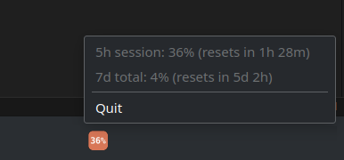

# claude-usage-tray

System tray app showing Claude Code's 5-hour session usage as a percentage on the tray icon.
Click the icon to see the full 5h session / 7d total breakdown.

Reads the OAuth token Claude Code already stores in `~/.claude/.credentials.json` and calls
the same (undocumented) usage endpoint Claude Code itself uses. Requires being logged in via
the `claude` CLI already.



## Setup & Run

Requires the [Rust toolchain](https://rustup.rs).

```
cargo run --release
```

The resulting binary (`target/release/claude-usage-tray`) is standalone -- copy it wherever
you like.

No system libraries are required on any platform: Linux uses the StatusNotifierItem D-Bus
protocol directly (via `ksni`), not GTK/AppIndicator; Windows and macOS use their native tray
APIs. TLS is statically linked (`rustls`), and the tray icon's font is embedded in the binary.

## Notes

- Polls every 180 seconds by default (see `src/constants.rs`).
- Token refresh uses a reverse-engineered, unofficial endpoint. If it stops working, the
  tray shows an auth-error state instead of crashing; you can override the refresh URL with
  the `CLAUDE_USAGE_TRAY_OAUTH_TOKEN_URL` environment variable.
- On Linux, left- and right-click both open the menu (StatusNotifierItem convention).
- The Windows/macOS backend follows the documented `tray-icon`/`muda`/`tao` APIs but has only
  been built and run on Linux -- if you hit issues there, please open one.
